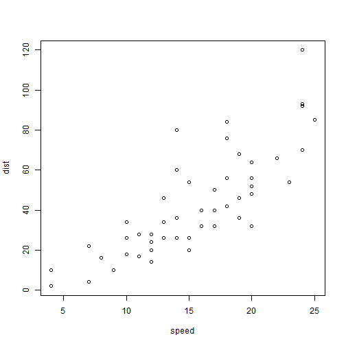

My Presentation
========================================================
author: kok hoe
font-import: http://fonts.googleapis.com/css?family=Risque
font-family: 'Risque'
date: Sat Apr 18 15:59:05 2015

First Slide
========================================================
transition: concave

For more details on authoring R presentations click the
**Help** button on the toolbar.

- Bullet 1
- Bullet 2
- Bullet 3

$x^2$
$$ $$

Slide With Code
========================================================


```r
summary(cars)
```

```
     speed           dist       
 Min.   : 4.0   Min.   :  2.00  
 1st Qu.:12.0   1st Qu.: 26.00  
 Median :15.0   Median : 36.00  
 Mean   :15.4   Mean   : 42.98  
 3rd Qu.:19.0   3rd Qu.: 56.00  
 Max.   :25.0   Max.   :120.00  
```

Slide With Plot
========================================================
transition: rotate
 

Slide section
========================================================
type: section


- section1 
- section 2


Here's a subsection
===
type: subsection

subsection

column 1
***
column 2
column 3

prompt slide
========================================================
type: prompt


- prompt
- section 2
